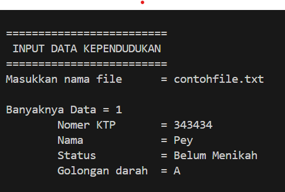
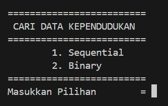
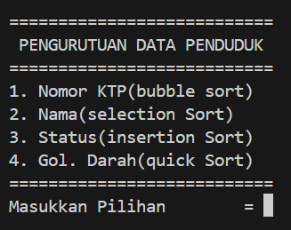
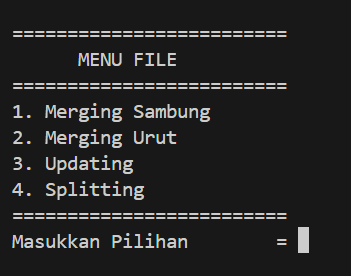

# cpp-kependudukan

## Tentang Proyek

Proyek berbasis C++ yang dirancang untuk mengelola data kependudukan. Proyek ini menekankan pada pemrograman file untuk open, write, read data, serta menyediakan berbagai menu untuk input dan output data, pencarian data, pengurutan data, dan manipulasi file seperti merging, updating, dan splitting.

## Fitur

- **Input dan Output Data:** Memungkinkan pengguna untuk memasukkan data kependudukan dan menyimpannya ke dalam file, serta membaca data dari file dan menampilkannya.
- **Searching Data:** Memfasilitasi pencarian data berdasarkan kriteria tertentu.
- **Sorting Data:** Menyediakan fitur untuk mengurutkan data berdasarkan kriteria.
- **File:**
  - **Merging:** Menggabungkan data dari beberapa sumber menjadi satu.
  - **Updating:** Memperbarui data yang sudah ada berdasarkan input baru.
  - **Splitting:** Memisahkan data menjadi beberapa bagian berdasarkan kriteria tertentu.

## Dokumentasi

Berikut adalah beberapa screenshot dari hasil running program:

### Input Data

### Searching Data

### Sorting Data

### File Menu
